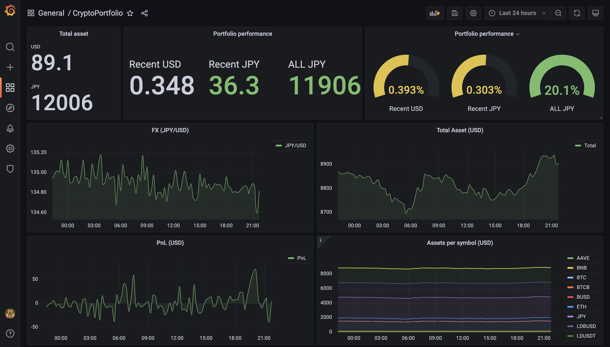
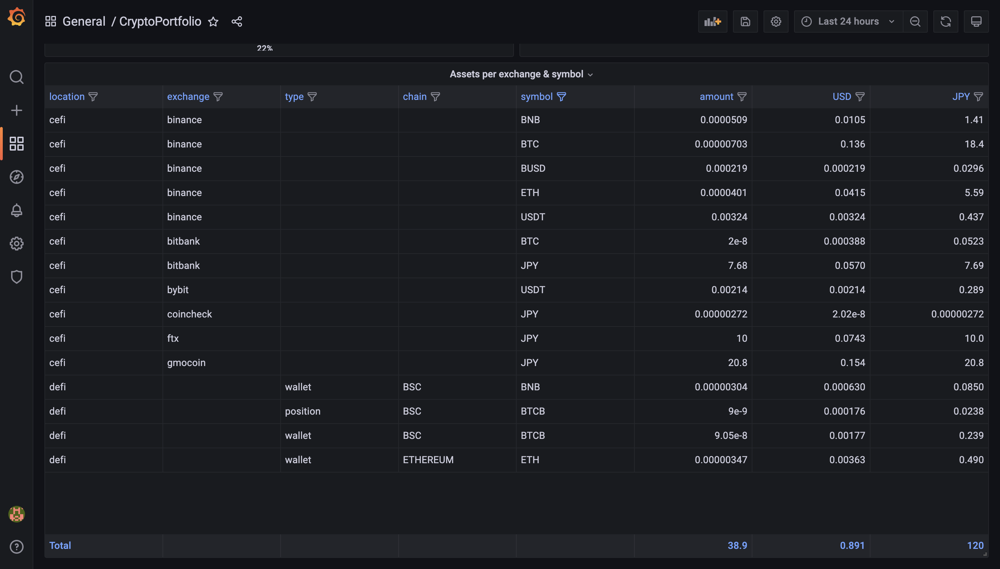

# crypto-portfolio

A bot to collect balance from CeFi/DeFi wallets and write to InfluxDB. Currently only available for spot wallets. Below is example of the dashboard:




## Architecture

- Execution: EC2 (Amazon Linux)
- Datastore: InfluxDB on EC2
- Visualization: Amazon Managed Grafana or Grafana on EC2
- Log: CloudWatch Logs
- Monitoring: CloudWatch Logs subscription filter -> AWS Lambda -> Slack
- Secret store: Amazon Secrets Manager

## Requirements

- AWS Account
- Access permission to CloudWatch Logs, Secrets Manager
- Store connection secrets for Influxdb, crypto exchanges
- Create a InfluxDB server
- Create a Grafana server connected to InfluxDB
- Create a ApeBoard portfolio URL
- Python3 (This software is tested on Python 3.9.9)

## Setup

### Packages

#### Python

Run `pip install -r requirements.txt`.

#### Chromium & Chromedriver

Add repository configuration.

```bash
sudo vi /etc/yum.repos.d/google-chrome.repo
```

Paste below & save.

```repo
[google-chrome]
name=google-chrome
baseurl=http://dl.google.com/linux/chrome/rpm/stable/$basearch
enabled=0
gpgcheck=1
gpgkey=https://dl-ssl.google.com/linux/linux_signing_key.pub
```

Install packages.

```bash
sudo yum update -y

sudo yum install python3 git -y
sudo yum install --enablerepo=google-chrome google-chrome-stable -y
google-chrome --version  # Google Chrome 94.0.4606.81

# Get Chromedriver for your Chrome version.
wget https://chromedriver.storage.googleapis.com/94.0.4606.61/chromedriver_linux64.zip
unzip chromedriver_linux64.zip

# Install double byte character fonts for Chrome  (not mandatory)
sudo yum install ipa-gothic-fonts ipa-mincho-fonts ipa-pgothic-fonts ipa-pmincho-fonts -y
```

#### Configs

1. Copy json templates from `config/template/config.json` to `config/config.json`
2. Edit parameters for `config/config.json`

## Run

To run only once, execute below. The program will run immediately. 

```bash
python main.py --debug
```

To run periodically, execute below in nohup (or tmux). Execution is scheduled at every 15min.

```bash
nohup python main.py > /dev/null &

# check process
ps aux | grep main.py
```

## Tips

If Chromedriver exited before calling `driver.close()` or `driver.quit()`, it's process will remain and use up memory and cpu. If you with to cleanup, run

```bash
ps aux | grep chrome | grep -v grep | awk '{ print "kill -9", $2 }' | sh
```

Note that `driver.close()` only closes current window. Use `driver.quit()` to close Chromedriver handling multiple window.
